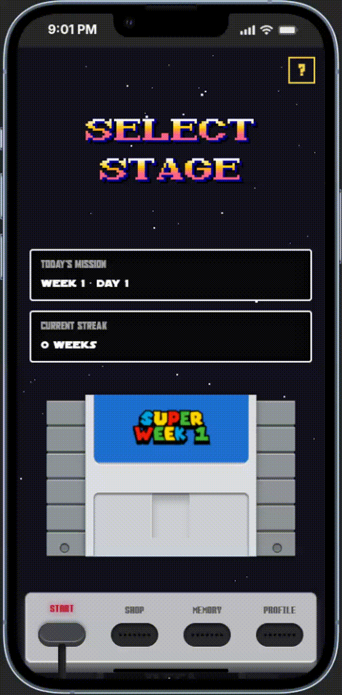

# SC25K — Retro Couch to 5K

SC25K is a retro game-inspired Couch to 5K app that turns each workout into a mission.
It combines interval training, progression tracking, and arcade-style feedback to make consistency fun.

## Demo

- Live app: https://sc25k.vercel.app
- Mobile PWA: installable from browser

## Showcase

### Core experience

- 9-week C25K journey with 3 sessions per week
- Guided intervals: warmup, run, walk, cooldown
- In-run controls with game-like visual feedback
- Option to skip initial warmup when needed

### Progress and motivation

- XP rewards for completed sessions
- Partial XP for canceled sessions based on progress
- Repeat-run XP policy to keep progression fair
- Weekly mission flow with streak feeling

### Social and gamification

- Global ranking view
- Profile customization (avatar + username)
- Retro-style XP shop and offers system
- Shareable completion card after each successful run

### Product polish

- PWA support for install-like behavior
- Route transitions and skeleton loading states
- Retro UI theme inspired by classic console aesthetics

## Demo

## Stack

- Vue 3 + Quasar
- Pinia
- Supabase (Auth, Database, Storage)
- Vite

## Architecture at a glance

- Main routes: Home, Shop, Profile, Ranking
- Auth routes: Login, Reset Password
- Data persisted via Supabase tables and storage buckets
- Business logic split across stores and service layer

## Optional: run locally

If you want to explore the code locally:

1. Install dependencies with `npm install`
2. Copy `.env.example` to `.env` and set the values:
   - `VITE_SUPABASE_URL`
   - `VITE_SUPABASE_ANON_KEY`
3. Start with `npm run dev`

## Vercel environment variables

Set these variables in your Vercel Project Settings → Environment Variables:

- `VITE_SUPABASE_URL`
- `VITE_SUPABASE_ANON_KEY`

After setting them, redeploy so the values are embedded at build time.

## Roadmap

Current and planned milestones are tracked in [ROADMAP.MD](ROADMAP.MD).
